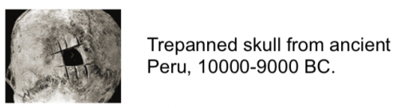

# History of Neuroscience
Interest in the brain is quite old.   

The idea of "neuroscience" is quite recent.
Computational neuroscience is the largest and fastest growing field in experimental biology.

Eventlist of [milestones in neuroscience research](https://faculty.washington.edu/chudler/hist.html). 

Computational neurobiology is a sub-field of neuroscience.   
There are also:
- [Developmental neurobiology](https://www.google.com/search?q=developmental+neurobiology) - development and maturation of the brain
- [Molecular neurobiology](https://www.google.com/search?q=molecular+neurobiology) - genetic determination of brain structure and function  
- [Neuroanatomy](https://www.google.com/search?q=neuroanatomy) - physical structure of the nervous system
- [Neurochemistry](https://www.google.com/search?q=neurochemistry) - chemical structure of the nervous system
- [Neuroethology](https://www.google.com/search?q=neuroethology) - neural basis of behavior
- [Neuropharmacology](https://www.google.com/search?q=neuropharmacology) - effects of compounds on the nervous system
- [Neurophysiology](https://www.google.com/search?q=Neurophysiology) - function of cells of the nervous system
- [Psychophysics](https://www.google.com/search?q=Psychophysics) - quantitative measurement of perception

## Leading Questions
- Where are the origins of neuroscience?
- What is the current status of neuroscience?

## Further Sources
- [History of neuroscience](https://www.google.com/search?q=history+of+neuroscience)

## Credits
- brief overview of related fields - thanks to [Bernstein Center for
Computational Neuroscience
Berlin](https://www.bccn-berlin.de/)
